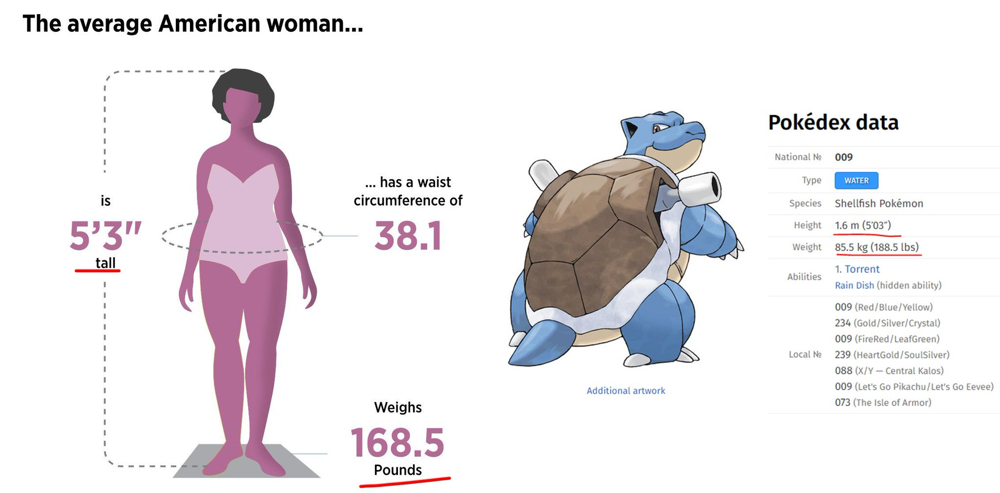

# Pokemetric!
[Live Site](https://roboseb.github.io/pokemetrics)

### About
Pokemetric allows you to compare yourself to every single pokemon currently released, from Gen I through Gen IX. I was initially inspired by the meme below. Turns out the average woman is somewhere between a Hypno and a Golduck.

### Features
- Enter your height and weight to learn which pokemon you're closest in size to.
- Or choose a particular pokemon to convert to, entering either their name or ID.
- Convert to a completely random pokemon.
- Convert to a random pokemon from any generation.
- Metric and imperial unit options.
- Cycle up and down through pokemon by ID.
- Wobble!

### Future Features
- Switch between multiple art styles for pokemon, including in game pixel art.
- View all forms of a particular pokemon.

### Known Issues
-    Pokemon #1013 Sinistcha previously threw errors on conversion, so is currently not available.
- Certain art may have strange aspect ratios depending on entered dimensions.
- Layout is very responsive but may not function ideally on certain devices.
  

### Credits
- [PokeAPI](https://pokeapi.co/)
- [Man Outline Art](https://www.vecteezy.com/free-vector/man-silhouette)
- [Game Boy Font](https://www.dafont.com/early-gameboy.font)
- [Canvas Trim Function](https://ourcodeworld.com/articles/read/683/how-to-remove-the-transparent-pixels-that-surrounds-a-canvas-in-javascript)